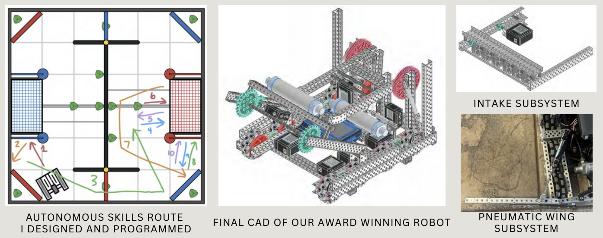

**Email:** henrycmack1@gmail.com  
**LinkedIn:** [www.linkedin.com/in/henrycmack1](https:www.linkedin.com/in/henrycmack1)

---

## About Me

Hi, I’m Henry! I’m a Florida native who loves theme parks, musical theatre, and building things that spark curiosity. As an aspiring game developer and engineering student, I’ve always been fascinated by how engineering and storytelling come together to create immersive experiences. I’m passionate about designing technology that not only solves problems but also inspires wonder.

---

## Projects

### KnightHacks VIII Project: TK vs Lenny – Titan Clash

**Inspiration**  
Inspired by this year’s hackathon theme, we wanted to create a fully immersive VR experience where players feel like they’re inside a giant mech defending a city from kaiju attacks. Combining VR and physical feedback was key, so we designed the game to let users actually feel the hits their mech takes.

**What it does**  
This project is a VR Roblox game where players take control of TK, a mech defending Orlando from Lenny and his kaiju friends. Physical feedback is integrated: a TENS machine connected to an ESP32 triggers sensations whenever the player is hit, making the battle feel more real.  

Originally, we planned to build in Unity, but Roblox allowed us to prototype quickly and reach users while still supporting VR.

**How we built it**  
- **Game Environment:** Designed in Roblox Studio with VR support.  
- **Player Mechanics:** Controlled TK’s movements and attacks in first-person VR.  
- **Feedback System:** ESP32 triggers TENS pads whenever the mech is hit.  
- **Programming:** Roblox Lua scripting for gameplay logic and interactions.  

---

### VR + AI Emergency Response Simulation
**VH-CRIT: Virtual High-Consequence Readiness Incident Training**  

- Built in Unity and powered by generative AI.  
- Places trainees in high-stakes radiological crisis scenarios with AI-driven first responders.  
- Streamlines traditional disaster training by providing immersive situational awareness and realistic dialogue.  
- Guides trainees through **IAEA response procedures**, evaluating decision-making against best practices.  

*Demo Video:*  
  

---

### Robotics - VEX 5956F (2023–2024: Over Under)
- Lead programmer and builder for the Excellence Award-winning team at the North Florida State Championship.  
- Qualified for the VEX World Championship.  
- Designed and programmed the autonomous skills route.  
- Managed social media, including Instagram and robot reveal videos.  
- Achieved quarterfinals at Worlds and won the Design award (only 8 of 480 teams receive this).  

**5956F Bangarang – VEX Robotics World Championship Reveal**  
Showcased our award-winning robot at the VEX Robotics World Championship, featuring innovative design and performance.

---
